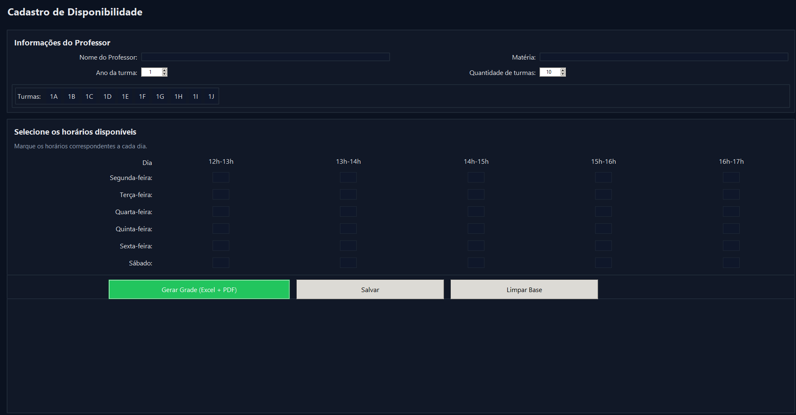
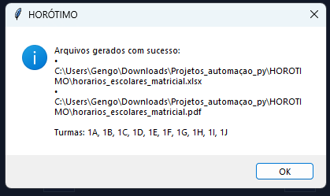
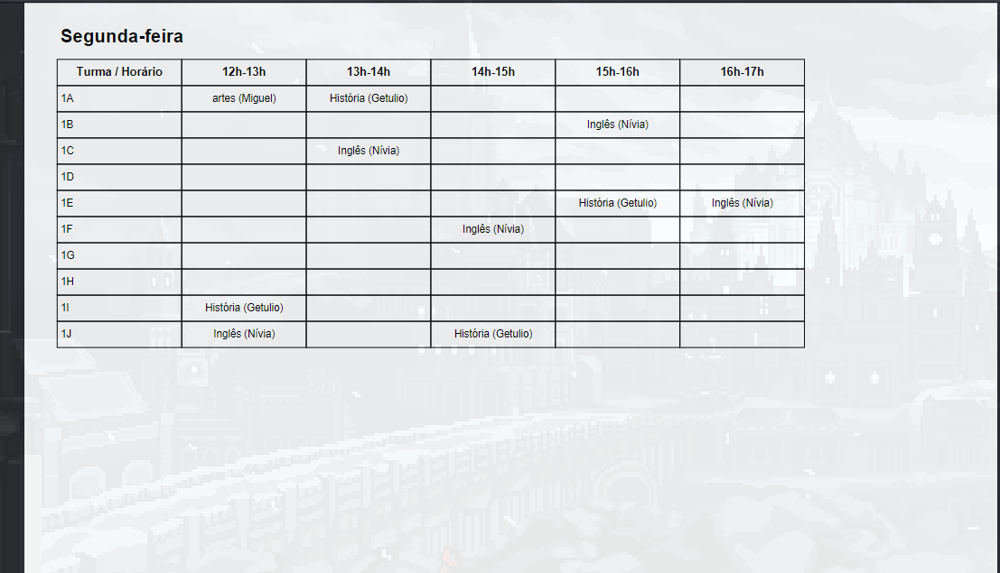

<!-- HERO BANNER -->
<p align="center">
  
</p>

<h1 align="center">TurmaGrid — Cadastro de Disponibilidade & Geração de Grade (GUI + Engine)</h1>

<p align="center">
  Sistema completo para <b>cadastrar disponibilidades de professores</b> e <b>gerar automaticamente</b> uma <b>grade escolar</b> em <b>Excel</b> e <b>PDF</b>.
</p>

<p align="center">
  <a href="#"></a>
  <a href="#"></a>
  <a href="#"></a>
  <a href="#"></a>
  <a href="#"></a>
  <a href="#"></a>
</p>

<p align="center">
  <b>Stack:</b> Python • Tkinter/ttk • pandas • NumPy • fpdf • Pathlib • JSON
</p>

---

## 🔎 Motivação

Este projeto nasceu a partir de uma das aulas do **Museu da Matemática – Prandiano**, como um estudo aplicado de **otimização prática** para escolas.  
A ideia foi transformar um problema recorrente — conciliar **disponibilidades docentes** e **restrições de grade** — em uma solução **reprodutível**, **visual** e **simples de operar** por equipes pedagógicas.

---

## 🎯 Objetivo

Converter disponibilidades pontuais (por professor e matéria) em uma **grade semanal coerente**, **validada por regras**, e pronta para distribuição (**Excel + PDF**).

---

## ✨ Destaques

- 🎛️ **GUI moderna** em Tkinter/ttk (tema escuro, chips de seleção por dia/horário, preview de turmas).  
- 🧠 **Engine reprodutível** (RNG com `seed=42`) e **validações** de conflitos.  
- 📦 **Exportação profissional**: planilha por dia no Excel + PDF com capa, legendas e páginas por dia.  
- 🧰 **Operação idempotente**: a base por `(Professor, Matéria)` é sempre substituída para evitar duplicatas.  
- 🔒 **Separação de responsabilidades** (GUI ↔ Engine) e arquivos de dados versionados com cuidado.

---

## ✅ Regras de Negócio

- Nunca aloca um professor em **dois horários simultâneos**  
- Usa apenas **slots marcados como disponíveis**  
- Se faltar professor, a célula **fica vazia**  
- **Resultados reprodutíveis** (seed fixa)

---

## 🧭 Arquitetura & Fluxo de Dados

- **GUI (`gui_professor_fullscreen.py`)**
  - Grava `data/professores.csv` com: **Professor, Materia, Dia, Horario**  
  - Persiste parâmetros em `data/ui_config.json` (**ano**, **qtd de turmas**, **rótulos**)

- **Engine (`GradeHorario`)**
  - Lê CSV + parâmetros, gera e exporta:  
    - `horarios_escolares_matricial.xlsx`  
    - `horarios_escolares_matricial.pdf`

- **Regras de nomenclatura**
  - Dias: `Segunda-feira` … `Sábado`  
  - Horários (padrão): `12h-13h` … `16h-17h`  
  - Turmas: `1A, 1B, …, 1Z, 1AA, 1AB, …`

> **Reprodutibilidade:** resultados consistentes entre execuções com `seed=42`.

---

## 🖥️ Interface Gráfica

- **Tema escuro** com componentes `ttk` customizados  
- **Formulário**: Professor, Matéria, Ano (spin), Quantidade (spin)  
- **Preview de turmas** em tempo real (`1A, 1B, …`)  
- **Chips clicáveis** (dia × horário) substituem checkboxes  
- **Geração** com confirmação e exibição de **paths absolutos**  
- **Limpar Base** zera `data/professores.csv` com confirmação  
- **Full-screen/zoom** automático (Windows/Linux/macOS)

---

## 📸 Preview App

<p align="center">
  
  
</p>
<p align="center">
  
  
</p>

---

## 📐 Modelagem (resumo prático)

- Conjuntos:  
  `D` (dias), `H` (horários), `T` (turmas), `P` (professores), `K ⊆ P×M` (pares prof/mat), disponibilidade `A_k ⊆ D×H`.

- Variável binária:  
  `x[k,t,d,h] ∈ {0,1}` indica alocação de `k` para turma `t` no slot `(d,h)`.

- Restrições:
  1) disponibilidade; 2) professor único por slot; 3) uma matéria por turma/slot.

- Objetivo (implícito): **maximizar preenchimento**.  
  Problema se decompõe por `(d,h)` como **emparelhamento bipartido** entre turmas e professores disponíveis.

---

## ⚙️ Algoritmo (implementado)

1. Embaralha `(prof, mat)` com RNG (seed 42)  
2. Varre slots disponíveis e aloca se:
   - turma livre no `(d,h)`  
   - professor não ocupado no mesmo `(d,h)`
3. Validações finais:
   - usa apenas horários disponíveis  
   - sem professor duplicado no mesmo slot

**Complexidade:** ~`O(A * T)` (A = total de marcações de disponibilidade)

---

## 🧾 Exportação (Excel + PDF)

- **Excel**: 1 planilha por dia; linhas = turmas, colunas = horários;  
  células: `"Matéria (Professor)"` ou vazio.
- **PDF**: capa → páginas por dia → legenda (Professor → Matérias), com cortes inteligentes de texto.

---

## 🗂️ Estrutura de Pastas

```
.
├─ gui_professor_fullscreen.py
├─ GradeHorario.py              # (arquivo privado — ver .gitignore)
├─ data/
│  ├─ professores.csv           # gravado pela GUI
│  └─ ui_config.json            # parâmetros da GUI
├─ horarios_escolares_matricial.xlsx
├─ horarios_escolares_matricial.pdf
└─ assets/
   ├─ banners/
   │  └─ turmagrid-hero.png     # banner do topo (1920x500 recomendado)
   └─ screens/
      ├─ menu.png
      ├─ geracao_arquivos.png
      ├─ limpar_base.png
      └─ resultado_pdf.png
```


---

## ▶️ Como Executar (local)

```bash
pip install pandas numpy fpdf
python gui_professor_fullscreen.py
```

**Fluxo:**  
Preencha *Professor* e *Matéria* → marque disponibilidades → **Salvar** → ajuste **Ano** e **Quantidade** → **Gerar Grade (Excel + PDF)** → confira os arquivos e a legenda.

---


## 🛣️ Roadmap

- [ ] Carga horária alvo por matéria/turma  
- [ ] Balanceamento de aulas por professor  
- [ ] Exportação para Google Sheets/CSV adicional  
- [ ] Modo CLI e empacotamento (`pipx`)  
- [ ] Testes automatizados (pytest) e validações extras

---

## 🙌 Agradecimentos

Projeto didático inspirado e desenvolvido a partir de uma das aulas do **Museu da Matemática – Prandiano**.  
Agradeço pela proposta pedagógica que incentivou aplicar modelagem e programação a um problema real de gestão escolar.

---

## 👤 Autor

**Miguel de Castilho Gengo**  
Estudante de Engenharia de Computação (PUC-Campinas) • Dev C/Java/Python • Robótica & Cibersegurança

**Links**
- GitHub: [@Gengo250](https://github.com/Gengo250)
- LinkedIn: [miguel-gengo-8157b72a1](https://www.linkedin.com/in/miguel-gengo-8157b72a1)
- E-mail: [miguelgengo28@gmail.com](mailto:miguelgengo28@gmail.com)

Se este setup te ajudou, deixa uma ⭐ no repositório e sinta-se à vontade para abrir uma *Issue* com sugestões.

---

## 📄 Licença

Uso **educacional/demonstrativo**. Adapte para sua realidade institucional antes de uso em produção.
